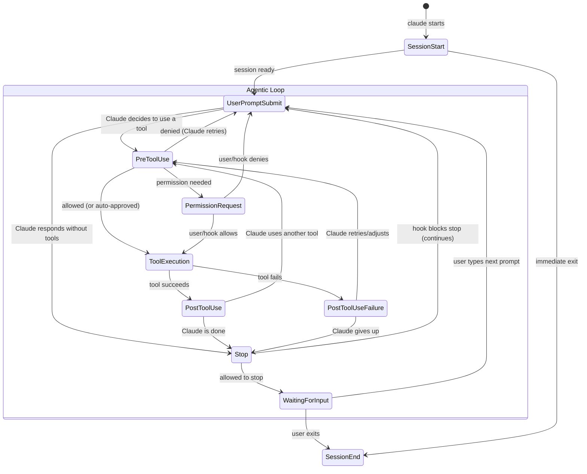
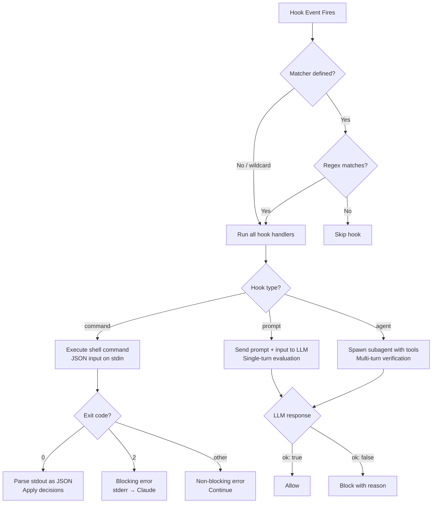
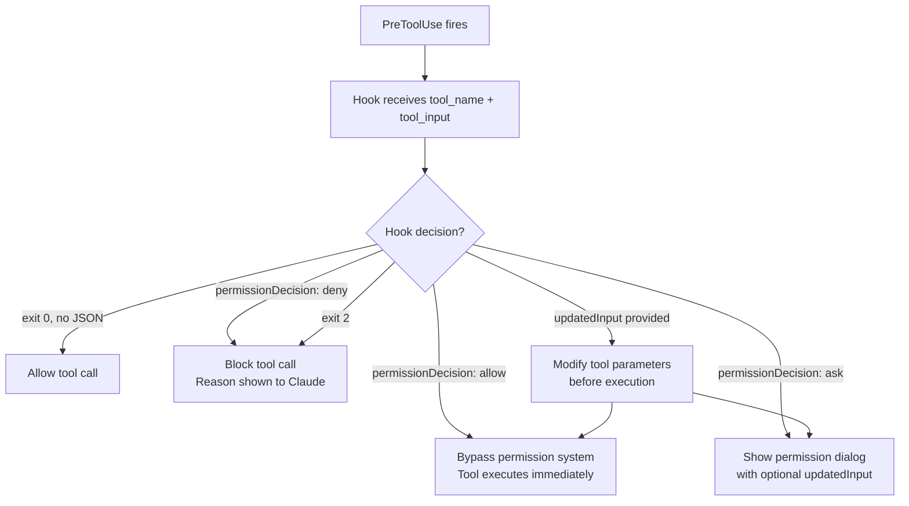
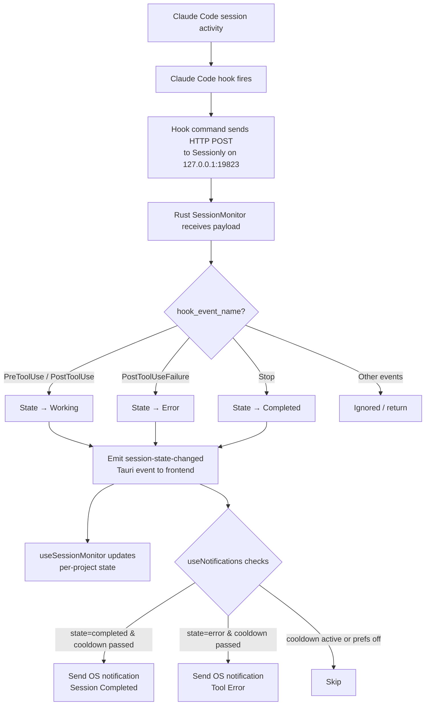
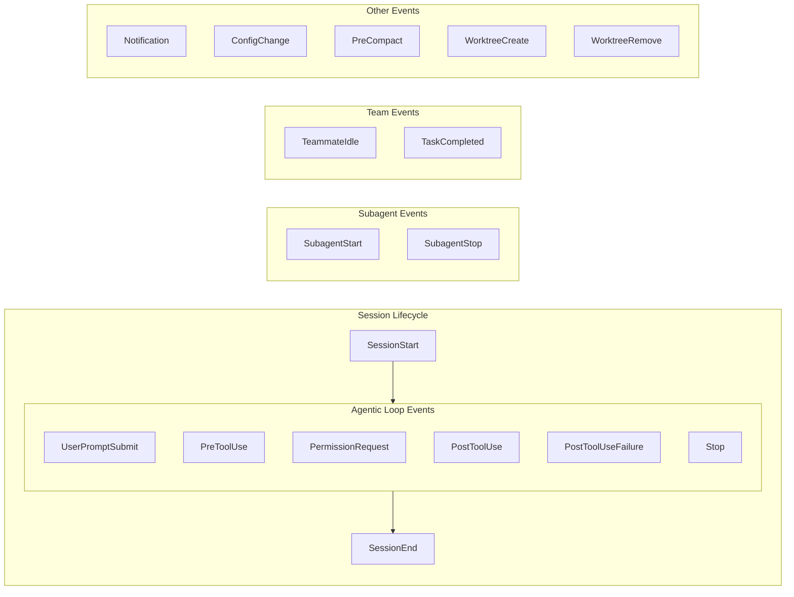
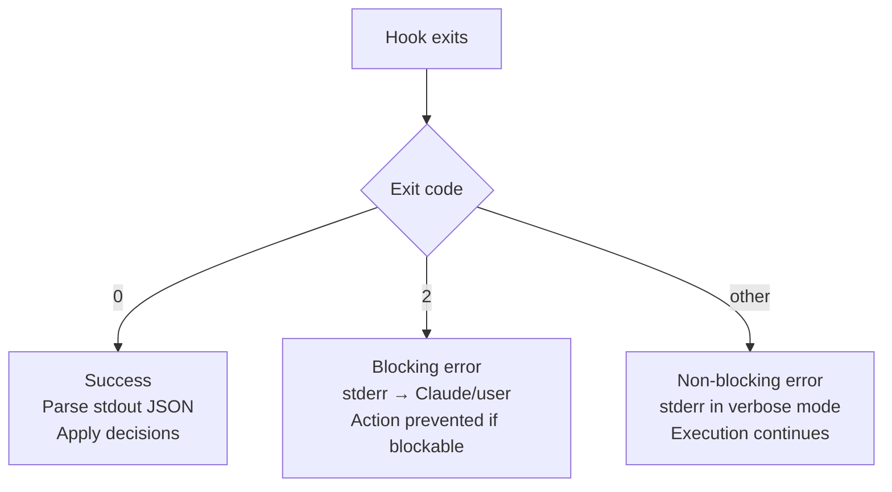

# Claude Code Hooks Reference

A comprehensive reference for building features on top of Claude Code hooks.

## Session Lifecycle State Machine



## Hook Event Flow



## PreToolUse Decision Flow



## Notification Event Flow (Sessionly Context)



## All Hook Events Summary



## Event Reference Table

| Event | Matcher | Can Block? | Hook Types | Key Use Case |
|-------|---------|------------|------------|-------------|
| `SessionStart` | `startup`, `resume`, `clear`, `compact` | No | command | Load context, set env vars |
| `UserPromptSubmit` | none | Yes | all | Validate/enrich prompts |
| `PreToolUse` | tool name regex | Yes | all | Block dangerous operations |
| `PermissionRequest` | tool name regex | Yes | all | Auto-approve/deny permissions |
| `PostToolUse` | tool name regex | No* | all | Lint, format, log after tool |
| `PostToolUseFailure` | tool name regex | No* | all | Error handling, alerts |
| `Notification` | notification type | No | command | Custom notification delivery |
| `SubagentStart` | agent type | No | command | Inject subagent context |
| `SubagentStop` | agent type | Yes | all | Verify subagent output |
| `Stop` | none | Yes | all | Enforce completion criteria |
| `TeammateIdle` | none | Yes | command | Quality gates for teams |
| `TaskCompleted` | none | Yes | command | Verify task completion |
| `ConfigChange` | config source | Yes | command | Audit/block config changes |
| `WorktreeCreate` | none | Yes | command | Custom VCS worktree |
| `WorktreeRemove` | none | No | command | Worktree cleanup |
| `PreCompact` | `manual`, `auto` | No | command | Pre-compaction actions |
| `SessionEnd` | exit reason | No | command | Cleanup, logging |

*PostToolUse/PostToolUseFailure: exit 2 shows stderr to Claude but tool already ran.

## Exit Code Semantics



## Hook Configuration Format

```json
{
  "hooks": {
    "<EventName>": [
      {
        "matcher": "<regex>",        // optional, filters when hook fires
        "hooks": [
          {
            "type": "command",       // "command" | "prompt" | "agent"
            "command": "script.sh",  // for type: command
            "prompt": "...",         // for type: prompt/agent
            "async": false,          // run in background (command only)
            "timeout": 600,          // seconds
            "statusMessage": "...",  // custom spinner text
            "model": "...",          // for prompt/agent
            "once": false            // run once per session (skills only)
          }
        ]
      }
    ]
  }
}
```

## Common Input Fields (stdin JSON)

Every hook receives these fields:

```json
{
  "session_id": "abc123",
  "transcript_path": "/path/to/transcript.jsonl",
  "cwd": "/current/working/directory",
  "permission_mode": "default",
  "hook_event_name": "PreToolUse"
}
```

Plus event-specific fields (e.g. `tool_name`, `tool_input`, `prompt`, `reason`, etc.)

## Sessionly's Hook Installation

Sessionly installs a hook that sends all events to its local HTTP server:

```json
{
  "hooks": [
    {
      "type": "command",
      "command": "curl -s -X POST -H 'Content-Type: application/json' -d @- http://127.0.0.1:19823/hook"
    }
  ],
  "matcher": "*"
}
```

The Rust `SessionMonitor` maps hook events to session states:
- `PreToolUse` / `PostToolUse` → **Working** (green)
- `PostToolUseFailure` → **Error** (red)
- `Stop` → **Completed** (amber) — triggers notification

---

Sources:
- [Hooks Reference - Claude Code Docs](https://code.claude.com/docs/en/hooks)
- [Claude Code Hooks Mastery (GitHub)](https://github.com/disler/claude-code-hooks-mastery)
- [DataCamp: Claude Code Hooks Guide](https://www.datacamp.com/tutorial/claude-code-hooks)
